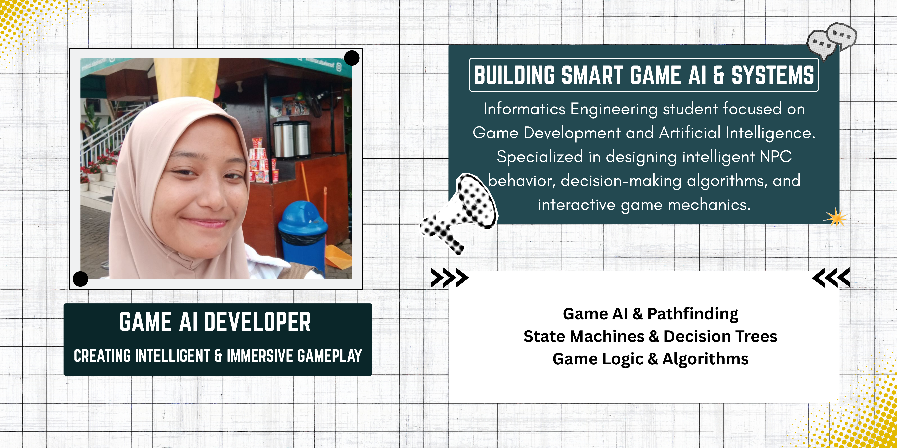

<!-- Banner Header -->

# Hi there 👋

Welcome to my page.

* 🏫 I'm currently Studying at **UNIVERSITAS DARUSSALAM GONTOR**
* 🛠️ I'm currently learning **Game Development**
* 🤝 I'm looking to collaborate on **Artificial Intelligence**

Thanks for visiting I'd like to connect

<!-- Social Badges -->

---

### 🛠️ Language and Tools

<!-- Tech Stack Icons -->

  

<!-- Technology Badges -->

  
  
  
  

---

### 📊 My Statistic Github

<!-- Visitor Counter -->

<!-- GitHub Trophies -->

<!-- Top Contributed / Streak -->
<!--

